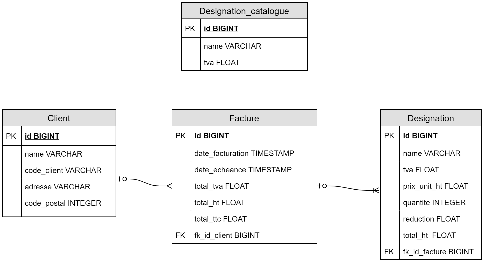

[comment]: <> "[](https://circleci.com/gh/Kevin-Vu/okayo-facture)"  
[](https://www.codacy.com/manual/Kevin-Vu/okayo-facture?utm_source=github.com&amp;utm_medium=referral&amp;utm_content=Kevin-Vu/okayo-facture&amp;utm_campaign=Badge_Grade)

# Circe-Spring-Boot

Manage your clients and their invoices.

## Prerequisite
```
$ docker pull postgres:11
$ docker run --name circe-postgres -p 5432:5432 -e POSTGRES_PASSWORD=password -d postgres:11
$ docker exec circe-postgres psql -U postgres -c "CREATE DATABASE \"CIRCE\"" postgres
```

## Compile and run test
```sh
$ mvn -U clean install
```

## Run the application
```sh
$ mvn spring-boot:run
```

## Access to api documentation
Once the app is running go to `http://localhost:8080/swagger-ui.html`

## Database 


## Front-End
Front Available [here](https://github.com/Kevin-Vu/circe-angular)
